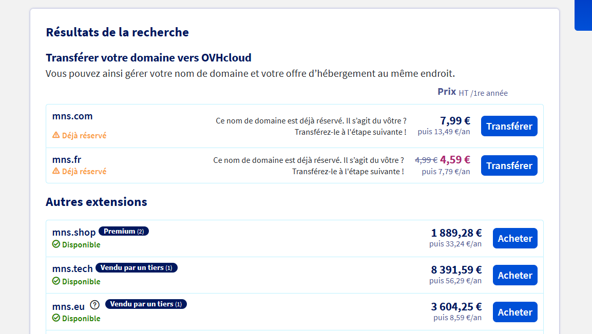
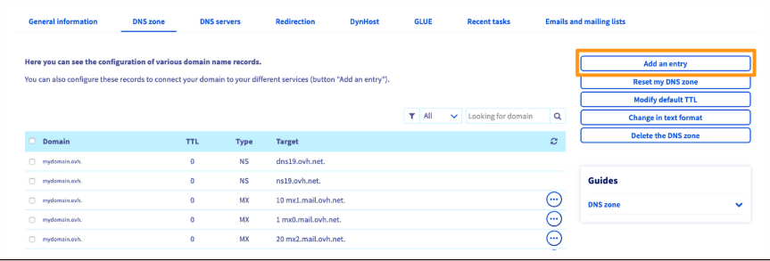
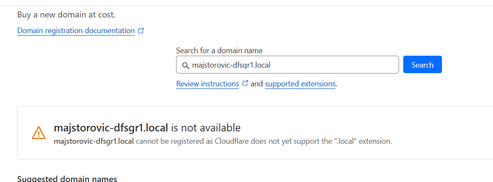

# Questions

Répondez ici aux questions théoriques en détaillant un maxium vos réponses :

1) Expliquer la procédure pour réserver un nom de domaine chez OVH avec des captures d'écran (arrêtez-vous au paiement) :

Je vais sur <https://order.eu.ovhcloud.com/fr/webcloud/#/webCloud/domain/select?selection=~()> puis je met le nom de domaine.

Là il me demande de choisir celui que je veux et après je dois payer.

2) Comment faire pour qu'un nom de domaine pointe vers une adresse IP spécifique ?

Au niveau de la "zone DNS OVHcloud" on peut choisir notre nom de domaine puis après on ajoute une entrée 

3) Comment mettre en place un certificat SSL ?

J'ai essayé avec aapannel mais impossible car nous avons un sous domaine, j'ai dû aller sur CloudFlare pour créer un token d'api puis l'ajouter dans "Domains" sur aapanel mais impossible car je ne peux pas créer un domaine du côté de cloudflare. Sinon j'aurais utilisé Let's Encrypt qui est gratuit.

